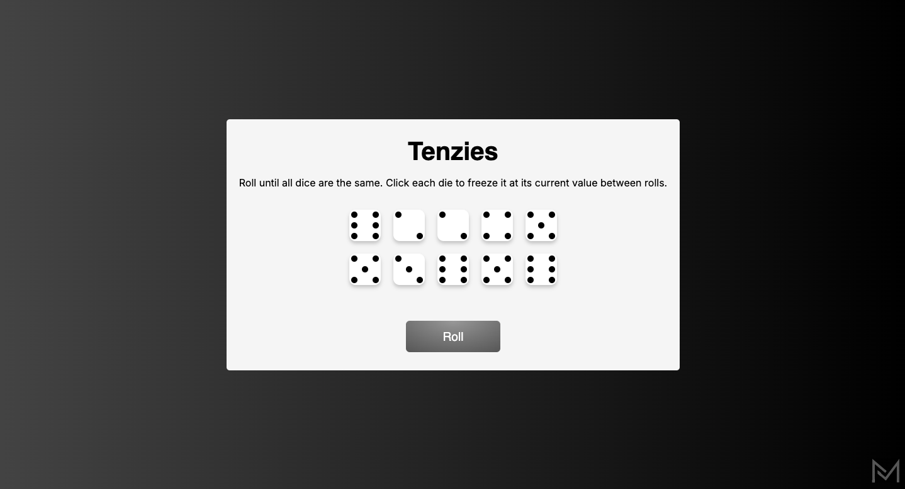
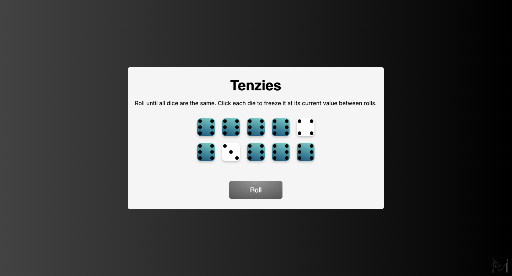
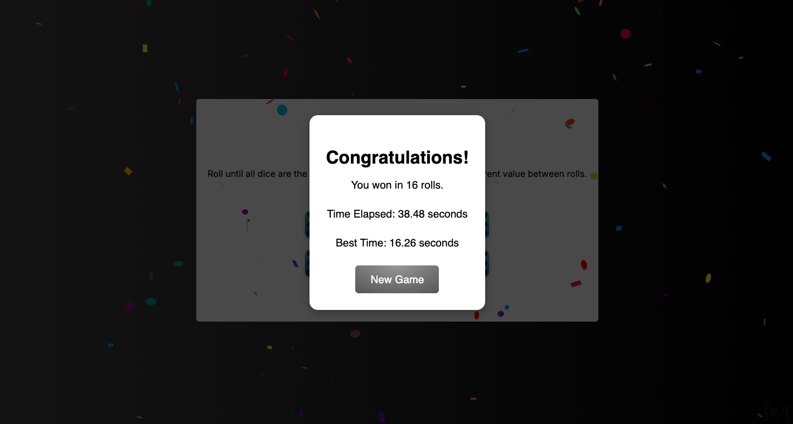

# Tenzies Game

*A react based web application*

This is a little game that I built using the react library. It operates via the web browser whereby a user rolls until all the dice are the same. The user can also click on each die to freeze at its current value or die between rolls. When all the dice have the same number of dots the game ends and displays a pop-up modal showing the number of rolls, the time elapsed and the best time which are stored on local storage.

The application has been nested with intuitive user interface to provide the user with a simplified navigation between elements. A very interesting and enticing gameplay experience. One can as well compete against each other or himself/herself.

To visit this game. Please click on this link below.

👇

<a href = "https://66bf45c1ac8fdb1c6a80792a--tenzia.netlify.app/">TENZIA</a>

## Mockup Screen 

### Index

### Gameplay Mode

### End Game

